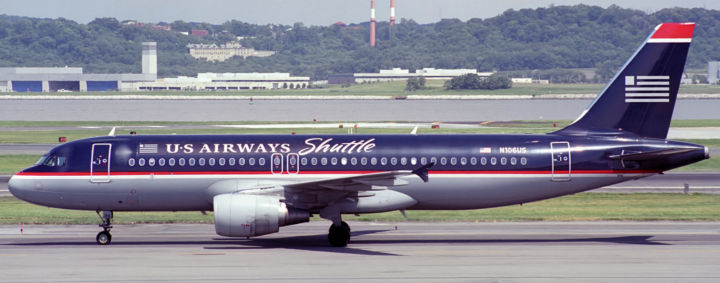

# Airplanes Solution

## Challenge Description

This airplane had to make an unusual landing. Where did it touch down?

Flag is in the format of flag{location_name}

Downloadable image shown below

## Solution

From the photo given it can be seen that the flight number of this aircraft is N106US. A quick search in google for "US Airways Shuttle N106US" will pull up a lot of information about this airplane. The first site that I found was https://www.airhistory.net/photo/230222/N106US. In this website it can be found that this airplane had to make an emergency landing in the Hudson River.

### flag{hudson_river}
